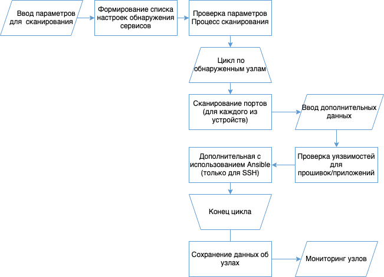
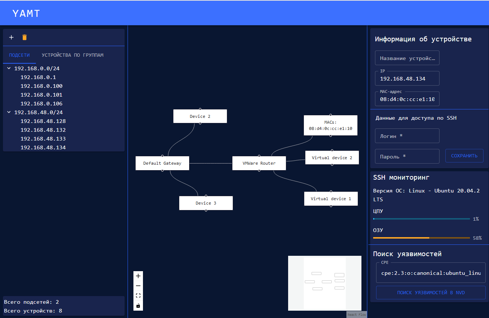

YAMT
====
Описание
-----------
Yet, another monitoring tool

Проект моей выпускной квалификационной работы.
Данный инструмент используется для мониторинга и настройки устройств внутри сети.

Приложение может проводить сканирование указанных подсетей на пример наличия сетевых устройств, а также обнаруживать открытые порты и, соответственно, протоколы, по которым можно производить общение с этими устройствами. В процессе, пришлось решать сложную задачу по предугадыванию, на какое устройство подключается инструмент. Понимание, какая операционная система, позволяет собирать большое количество данных через протокол SSH.
Как итог, было создано веб-серверное приложение, которое сканирует указанный диапазон сети, строит примерную топологию этой сети. Если в сети имеются устройства с включенным SSH доступом - при знании логина и пароля, имеется возможность подключения к ним и получения данных и метрик устройства.
Реализован мониторинг устройств и сети. Мониторинг является опциональным и при ненадобности его можно отключить.

Алгоритм работы
-----------

|ImageLink|_

.. _ImageLink: https://drive.google.com/file/d/1cLswz6z9NI1WcZhW27mhcb9v5RlCu6nu/view?usp=sharing

`Ссылка на диплом <https://docs.google.com/document/d/1gMBWd9PxxamdXIfY7KBCfZ-X6M0dPEJ3/edit?usp=sharing&ouid=101197624745946111130&rtpof=true&sd=true>`_

Скрины
-----------

